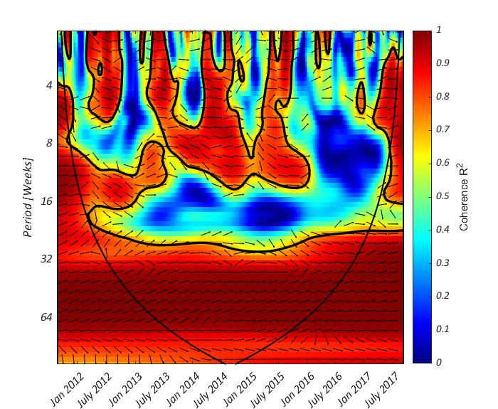
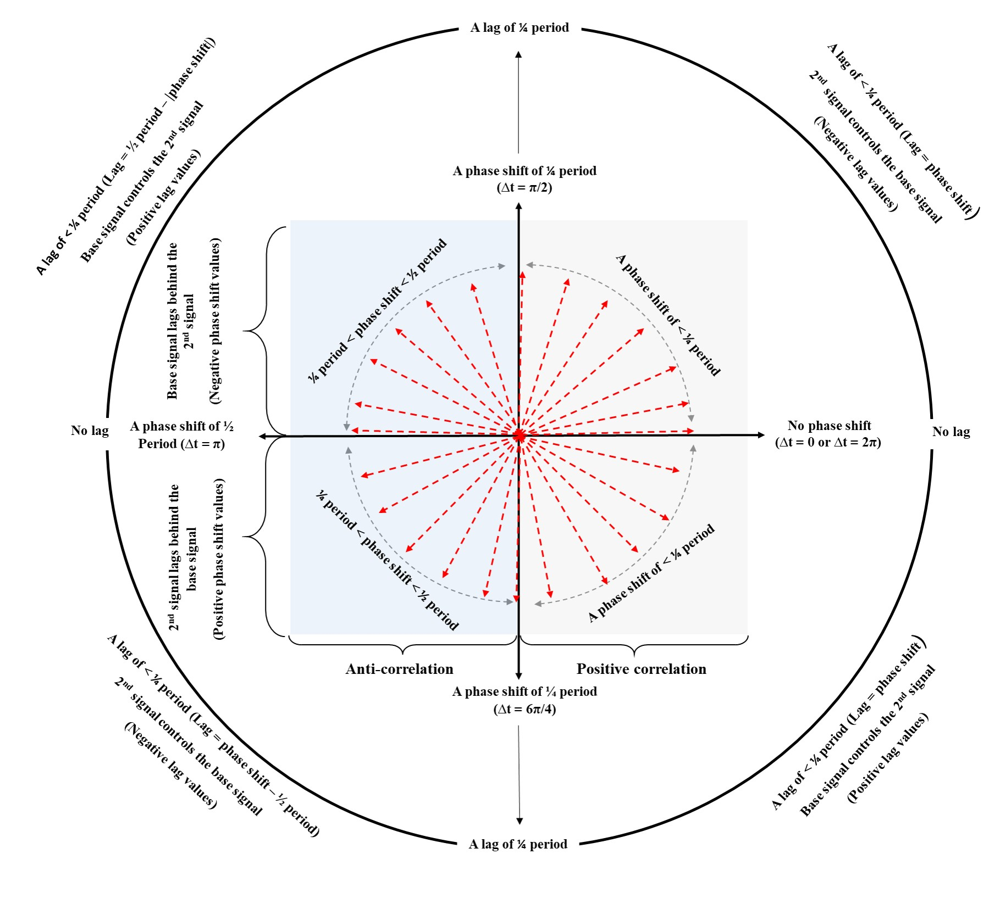
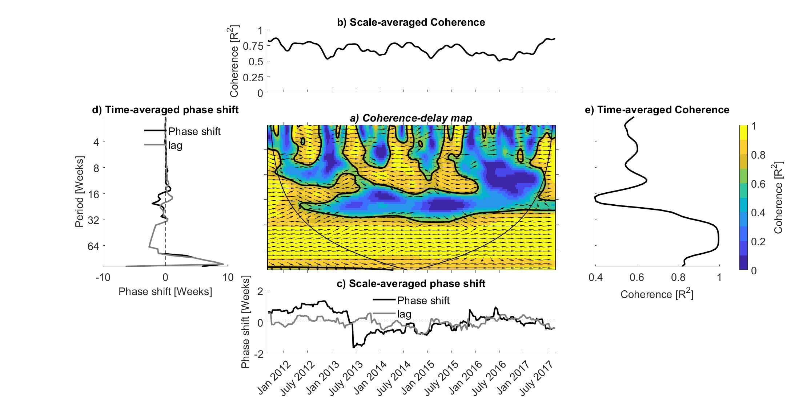

# A Matlab script for the representation of coherence delay maps

Welcome to the repository for Wavelet Coherence Map Plotter. 
This repository contains the codes and sample data for better illustration of wavelet coherence analysis, along with documentation and instructions for usage.

## Overview

The [Grinsted, Moore, and Jevrejeva (2004)](https://npg.copernicus.org/articles/11/561/2004/) developed a software package to conduct the wavelet coherence analysis (WCA), 
where a Monte Carlo approach is used to determine the significance of localized coherence and 
the continuous, nonorthogonal Morlet wavelet is selected as the mother wavelet function.
The WCA allows an in‐depth correlation analysis between two different signals, where it quantifies the strength of the correlation (i.e., the coherence) and
the phase shift (delay) between the studied signals for each point in the time and frequency domains [(Rahmati et al., 2020)](https://acsess.onlinelibrary.wiley.com/doi/full/10.1002/vzj2.20029).
The wavelet map obtained from WCA analysis is very informative and comes with arrows and colors. A simple output of WCA can look like as below:

**Figure 1**: Simple wavelet coherence plot obtained from the application of Matlab package developed by [Grinsted, Moore, and Jevrejeva (2004)](https://npg.copernicus.org/articles/11/561/2004/) over differences in soil water content (ΔSWC) as the base signal and difference in evapotranspiration (ΔET) as the second signal.

As supplemental Material to our paper, [Rahmati et al. (2020)](https://acsess.onlinelibrary.wiley.com/doi/full/10.1002/vzj2.20029), we provide a simple analysis of several artificial signals using WCA to 
describe the concepts of perfect correlation, anticorrelation, and phase shift or phase angle, which can be obtained from a wavelet map.
One can summarize the arrow directions and the positive and negative correlations between the base signal yb and a second signal yi 
with Δt values varying between zero and 2π (see figure below):

 
**Figure 2**: Phase shift, lag, correlations, and arrow directions on wavelet map between base signal (with Δt = 0) and a second signal with Δt values varying between zero and 2π. Red arrows illustrate the arrow directions on the wavelet map. The phase shift is the difference in timing of two consecutive maximal values of the examined signals while lag is the difference in timing of the two consecutive features (maximum or minimum) of examined signals

To summarise that information in one plot, we introduce this plotter. Such information for the above wavelet map can be summarized as below:

**Figure 3**: Coherence‐delay plots between differences in soil water content (ΔSWC) as the base signal and difference in evapotranspiration (ΔET) as the second signal. Panel (a) shows the coherence‐delay map, panel (b) the scale‐averaged coherence, panel (c) the scale‐averaged phase shift, panel (d) the time‐averaged phase shift, and panel (e) the time‐averaged coherence.

Examples usage of the Coherence‐delay plot and the interpretations can be found in [Rahi et al. (2024)](https://www.sciencedirect.com/science/article/pii/S0022169424012113?via%3Dihub) and [Dari et al. (2024)](https://agupubs.onlinelibrary.wiley.com/doi/10.1029/2023WR036510).

## Repository Structure

- **README.md**: You are here! This file provides an overview of the repository.
- **Codes**: Contains all the code related to the research project.
- **Data**: Contains datasets used in the research project.
- **Documentation**: Contains additional documentation related to the research project.
- **License**: Specifies the terms of use for the code and data.
- **environment.yml**: Specifies the required dependencies for running the code.
- **Output**: Provides main outputs of the code.

## Usage

No special environment is required.  

## License

MIT License

## References

1. Grinsted, A., Moore, J. C., and Jevrejeva, S.: Application of the cross wavelet transform and wavelet coherence to geophysical time series, Nonlin. Processes Geophys., 11, 561–566, https://doi.org/10.5194/npg-11-561-2004, 2004.
2. Rahmati M, Groh J, Graf A, Pütz T, Vanderborght J, Vereecken H. On the impact of increasing drought on the relationship between soil water content and evapotranspiration of a grassland. Vadose Zone J. 2020; 19:e20029. https://doi.org/10.1002/vzj2.20029
3. Dari, J., Quintana‐Seguí, P., Barella‐Ortiz, A., Rahmati, M., Saltalippi, C., Flammini, A., & Brocca, L. (2024). Quantifying the hydrological impacts of irrigation on a Mediterranean agricultural context through
explicit satellite‐derived irrigation estimates. Water Resources Research, 60, e2023WR036510. https://doi.org/10.1029/2023WR036510
4. Rahi, A., Rahmati, M., Dari, J., Bogena, H., Vereecken, H., & Morbidelli, R. (2024). Combining signal decomposition and deep learning model to predict noisy runoff coefficient. Journal of Hydrology, 641, 131815. https://doi.org/10.1016/j.jhydrol.2024.131815

## To be Cited:
Rahmati. M., 2024. A Matlab script for the representation of coherence delay maps. 

## Contact

Mehdi Rahmati
Email: mehdirmti@gmail.com
Alternative email: m.rahmati@fz-juelich.de

